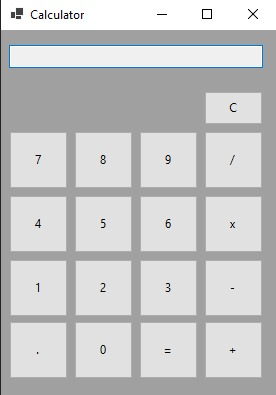
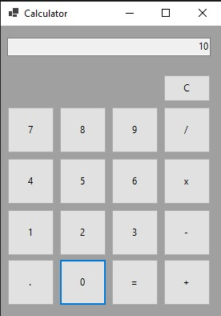
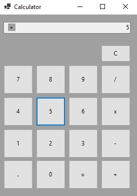
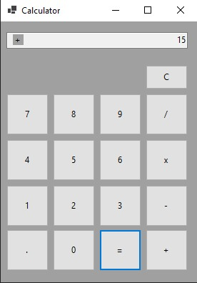



<h1 align="center">📟 Calculator 📟</h1>

<h2 id=objective>📜 About</h2>  

<h3>Images:</h3>

  

  

This exercise serves as a practical training ground for honing Windows Forms skills. While currently a basic calculator, the intention is to elevate its functionality to encompass a broader spectrum. The envisioned enhancements include transforming it into a scientific calculator, integrating features for currency conversion, and enabling the conversion of binary, hexadecimal, and octal numbers. Furthermore, there is a commitment to refining its visual aesthetics for a more polished appearance.

<h2 id=technology>🧰 Technologies</h2>

- IDE: <a href="https://visualstudio.microsoft.com/pt-br/vs/">Visual Studio 2022</a>
- SDK: <a href="https://dotnet.microsoft.com/pt-br/download/dotnet/6.0">.Net 6</a>
  
<h2 id=author>😎 Author</h2>

Developed by <a href="https://www.linkedin.com/in/arthurvga/" target="_blank">Arthur Verissimo</a>

<h2 id=licence>🆓 License</h2>

<a href="https://github.com/ArthurVGA1/Calculator_WindowsForms/blob/master/LICENSE.txt" target="_blank">MIT</a>
